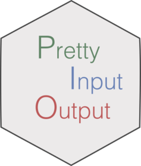

<!-- badges: start -->

[](https://travis-ci.org/caravagn/pio)
<!-- badges: end -->


# pio - pretty I/O

`pio` is a package to print nice coloured outputs to the console.

If you work with R scripts that generate several loads or outputs, or if you just like to organize in a tidy way on-screen outputs of your computataions, then `pio`'s pretty I/O system is the package that you are looking for.

`pio` explots the great `crayon` [package](https://github.com/r-lib/crayon) to render couloured text to the console. The package provides a very simple interface to visualize three types of messages:

* headers;
* titles with separators;
* strings with coloured values;

Use `pio` to easily achieve a tidy and coloured organisation of your messages, so that your users will find it easier to spot relevant information from your functions' outputs. 


#### Help and support

`pio` has its own webpage at [GitHub pages](https://caravagn.github.io/pio/).

-----

### Installation

You can install the released version of `pio` from
[GitHub](https://github.com/) with:

``` r
# install.packages("devtools")
devtools::install_github("caravagn/pio")
```

-----

#### Copyright and contacts

Giulio Caravagna, PhD. _Institute of Cancer Research, London, UK_.

* Personal webpage: [https://bit.ly/2kc9E6Y](https://sites.google.com/site/giuliocaravagna/), 
* Email address: [giulio.caravagna@icr.ac.uk](mailto:giulio.caravagna@icr.ac.uk) and [gcaravagn@gmail.com](mailto:gcaravagn@gmail.com)
* Twitter feed: [@gcaravagna](https://twitter.com/gcaravagna)
* GitHub space: [caravagn](https://github.com/caravagn)

